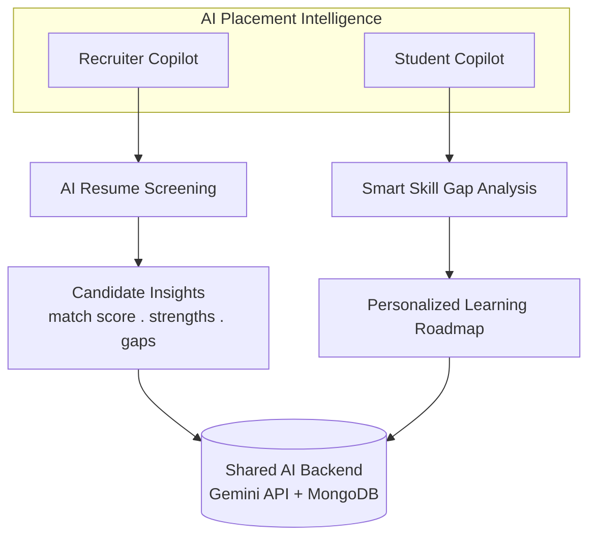
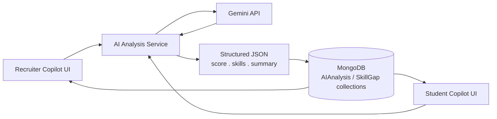
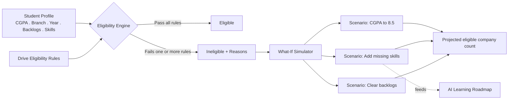
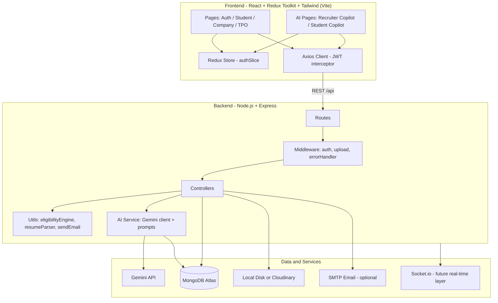
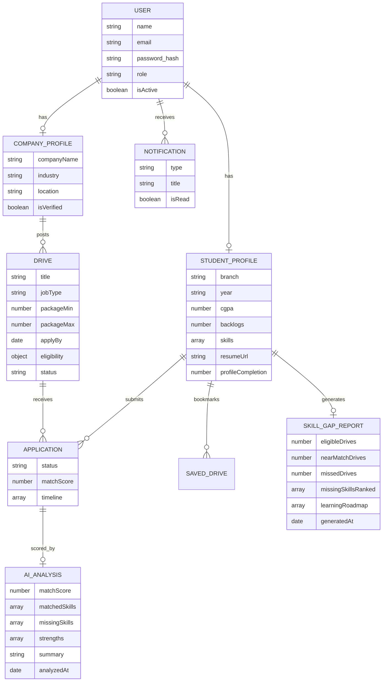
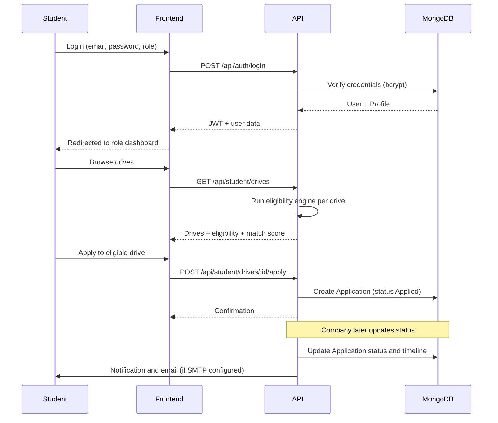
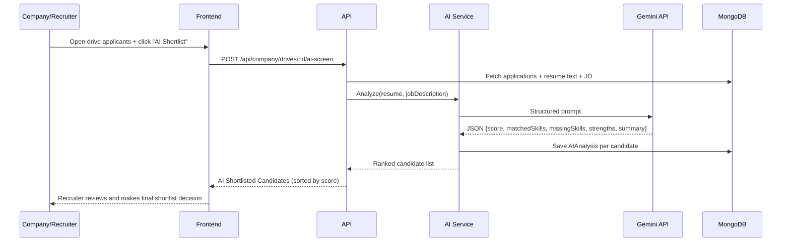
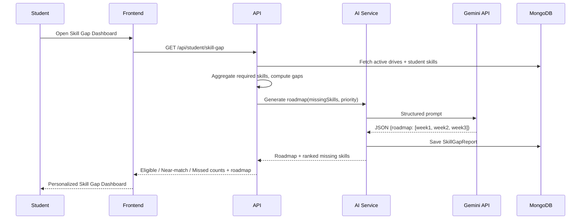

# 🎓 Campuslytics — Placement & Internship Portal
## 🚀 Live Demo
👉https://campuslytics-kpjt.vercel.app/

**Your Campus. Your Career.**
A full-stack MERN platform that centralizes student, company, and TPO placement workflows — automated eligibility checks, application tracking, live placement analytics, and an **AI Placement Intelligence** layer that gives recruiters an AI-ranked shortlist and gives students a personal skill-gap coach.


---

## 📋 Table of Contents

- [Problem Statement](#-problem-statement)
- [Core Features](#-core-features)
- [🧠 AI Placement Intelligence](#-ai-placement-intelligence-new)
- [Standout Feature: Eligibility Simulator](#-standout-feature-placement-eligibility-simulator)
- [Architecture](#️-architecture)
- [Data Model (ER Diagram)](#️-data-model-er-diagram)
- [Key Flows](#-key-flows)
- [Tech Stack](#️-tech-stack)
- [Project Structure](#-project-structure)
- [Getting Started](#-getting-started)
- [Demo Accounts](#-demo-accounts)
- [Environment Variables](#️-environment-variables)
- [Bulk Student Import Format](#-bulk-student-import-format)
- [Deployment](#️-deployment)
- [Roadmap](#️-roadmap)

---

## 📌 Problem Statement

Colleges often manage placements through spreadsheets, emails, and manual screening — making it hard to track applications, filter eligible students, and analyze placement trends. Recruiters manually skim hundreds of resumes per drive, and students are left guessing why they got rejected. **Campuslytics** replaces that with a single platform that automates eligibility checks, application tracking, placement analytics, **and now AI-assisted screening and skill guidance** for students, companies, and the TPO office.

---

## ✨ Core Features

| Role | What they can do |
|---|---|
| 🎓 **Student** | Build a profile (branch, CGPA, year, skills, backlogs), upload a resume (auto-parsed for skills), browse/filter drives, see per-drive eligibility + resume match score, apply, bookmark, track application status, run the Eligibility Simulator, **use the AI Skill Gap Dashboard** |
| 🏢 **Company** | Manage company profile, post/edit/close drives with structured eligibility rules, view applicants ranked by match score, move applicants through the pipeline (Applied → Shortlisted → Interview → Selected/Rejected), **use the AI Recruiter Copilot to auto-rank candidates** |
| 🛠️ **TPO / Admin** | Manage students & companies, bulk-import students via CSV/Excel, view all drives & applications platform-wide, export CSV reports, view the placement analytics dashboard |

All three roles get **JWT-secured, role-gated access** and an in-app **notification center** (applications, interviews, system messages).

---

## 🧠 AI Placement Intelligence 

A dedicated AI module sitting on top of the existing platform — **one shared AI backend, two copilots**. It doesn't replace any decision-maker: **the AI assists, the recruiter still decides.**



### 🤖 Feature 1 — Recruiter Copilot (AI Resume Screening)

**Problem:** Recruiters/TPOs manually scan hundreds of resumes per drive.
**Solution:** An AI assistant that reads every applicant's resume against the drive's job description and returns a ranked, explainable shortlist.

```
AI Shortlisted Candidates
Frontend Developer Drive • Ranked by match score

  🟢 Aditi Sharma   — Strong React portfolio             94%
  🟡 Rahul Verma    — Good frontend experience            87%
  🟠 Priya Singh    — Needs stronger backend skills        76%
```

Each candidate card includes: **match score**, **matched skills**, **missing skills**, **key strengths**, and a short **AI-generated summary** — sortable and filterable on the recruiter dashboard. The recruiter still clicks Shortlist/Reject; the AI never auto-decides.

### 🎯 Feature 2 — Student Copilot (Smart Skill Gap Dashboard)

**Problem:** Students see "Not Eligible" with no explanation and no next step.
**Solution:** A dashboard that answers *"Why am I not eligible?"*, *"How do I become eligible?"*, and *"What should I learn next?"* — by comparing the student's skills against requirements aggregated across every active drive.

```
Your Skill Gap Dashboard
Personalized recommendations based on placement drives

  Eligible drives          8
  Near-match drives        5
  Missed opportunities    12

  Node.js       — Missing in 9 drives
  Docker        — Missing in 6 drives
  TypeScript    — Missing in 4 drives

  AI Learning Roadmap
  Week 1 — Learn Node.js fundamentals
  Week 2 — Build a REST API
  Week 3 — Learn Docker basics
```

### 🔗 Shared AI Backend

Both copilots call the **same** pipeline — one Gemini integration, one response schema, one place to tune prompts — instead of two separate AI systems:



### 🧩 Build Phases

| Phase | Scope | Steps |
|---|---|---|
| **Phase 1 — AI Foundation** | Core plumbing | Gemini API integration → resume text extraction → structured JSON response contract → persist AI analysis in MongoDB |
| **Phase 2 — Recruiter Copilot** | Recruiter-facing | Analyze candidate vs. drive JD → compute match score → extract matched/missing skills → extract strengths → generate candidate summary → recruiter dashboard UI → sort/filter by score |
| **Phase 3 — Student Copilot** | Student-facing | Aggregate required skills across all drives → compare vs. student skills → skill-gap calculation → priority ranking (by # drives affected) → Smart Skill Gap Dashboard UI → AI learning roadmap generation |


---

## 🧠 Standout Feature: Placement Eligibility Simulator

A fully **rule-based** engine (no ML required) that helps students understand *and improve* their eligibility:

- Shows how many companies they're currently eligible for
- Explains **exactly why** they're ineligible for a given drive (CGPA, branch, year, backlogs, or missing skills)
- Runs **what-if scenarios**: "If your CGPA becomes 8.5", "If you add these missing skills", "If you clear your backlogs" — and shows the eligibility gain for each
- Aggregates missing skills across all near-miss drives into one actionable list
- Feeds directly into the **AI Learning Roadmap** above — the simulator's missing-skill output is exactly what the Student Copilot prioritizes



---

## 🏗️ Architecture



---

## 🗂️ Data Model (ER Diagram)



---

## 🔄 Key Flows

**Authentication & Application Lifecycle**



**AI Recruiter Copilot Flow**



**AI Student Copilot Flow**



---

## 🛠️ Tech Stack

**Frontend:** React 18 · Redux Toolkit · React Router DOM · Tailwind CSS · Axios · Recharts · Vite
**Backend:** Node.js · Express.js · Mongoose · JWT · bcrypt.js · Multer
**Database:** MongoDB (Atlas or local)
**AI Layer:** Google **Gemini API** · shared AI service module · structured JSON response contracts persisted to MongoDB
**Resume Processing:** `pdf-parse` + custom keyword-extraction skill dictionary (rule-based baseline the AI layer builds on)
**File Storage:** Local disk by default, optional Cloudinary
**Notifications:** In-app + Nodemailer (optional SMTP), Socket.io wired as a future real-time layer
**Analytics:** MongoDB aggregation-style queries + Recharts (bar & pie charts)
**Reports:** CSV export via `csv-writer`
**Bulk Import:** SheetJS (`xlsx`) parses CSV/Excel client-side before posting to the API

---

## 📁 Project Structure
campuslytics/
├── README.md
├── README_AI.md                             # Complete AI setup & run instructions
│
├── backend/
│   ├── .env                                 # Server, MongoDB URI & GEMINI_API_KEY
│   ├── .env.example
│   ├── .gitignore
│   ├── package.json                         # Includes @google/genai, test:ai script
│   ├── package-lock.json
│   └── src/
│       ├── app.js                           # [MODIFIED] Mounted /api/ai routes
│       ├── server.js                        # HTTP server & socket initialization
│       │
│       ├── config/
│       │   └── db.js                        # MongoDB Mongoose connection
│       │
│       ├── services/                        # [NEW DIRECTORY]
│       │   └── geminiService.js             # [NEW] Gemini API client + Heuristic fallback engine
│       │
│       ├── models/
│       │   ├── AiCandidateAnalysis.js       # [NEW] Match score, ATS score & candidate evaluation
│       │   ├── StudentRoadmap.js            # [NEW] Skill gap answers, missing skills & weekly roadmap
│       │   ├── Application.js               # Drive application schema
│       │   ├── CompanyProfile.js
│       │   ├── Drive.js
│       │   ├── Notification.js
│       │   ├── SavedDrive.js
│       │   ├── StudentProfile.js
│       │   └── User.js
│       │
│       ├── controllers/
│       │   ├── aiController.js              # [NEW] Recruiter & Student AI endpoint controllers
│       │   ├── authController.js
│       │   ├── companyController.js
│       │   ├── notificationController.js
│       │   ├── studentController.js
│       │   └── tpoController.js
│       │
│       ├── routes/
│       │   ├── aiRoutes.js                  # [NEW] /api/ai endpoints
│       │   ├── authRoutes.js
│       │   ├── companyRoutes.js
│       │   ├── notificationRoutes.js
│       │   ├── studentRoutes.js
│       │   └── tpoRoutes.js
│       │
│       ├── middleware/
│       │   ├── auth.js                      # JWT protect & role authorize
│       │   ├── errorHandler.js
│       │   └── upload.js                    # Multer resume file upload
│       │
│       ├── utils/
│       │   ├── testAi.js                    # [NEW] CLI verification tool (npm run test:ai)
│       │   ├── seed.js                      # [MODIFIED] Seed with realistic candidates & drives
│       │   ├── eligibilityEngine.js
│       │   ├── generateToken.js
│       │   ├── resumeParser.js              # PDF resume parser
│       │   └── sendEmail.js
│       │
│       └── uploads/                         # Directory for uploaded resume PDFs
│
└── frontend/
    ├── index.html
    ├── package.json                         # React 19, Vite, Recharts, Lucide
    ├── package-lock.json
    ├── postcss.config.js
    ├── tailwind.config.js
    ├── vite.config.js
    │
    ├── public/
    │   ├── favicon.svg
    │   └── icons.svg
    │
    └── src/
        ├── App.jsx                          # [MODIFIED] Registered AI Copilot & Skill Gap routes
        ├── index.css                        # Tailwind directives & design system
        ├── main.jsx
        │
        ├── api/
        │   ├── client.js                    # Axios instance with auth interceptor
        │   └── endpoints.js                 # [MODIFIED] Added aiApi endpoints
        │
        ├── app/
        │   ├── store.js                     # Redux Toolkit store
        │   └── features/
        │       └── authSlice.js
        │
        ├── components/
        │   ├── ai/                          # [NEW DIRECTORY]
        │   │   └── AiJobMatchModal.jsx      # [NEW] AI Job Match Report modal (ATS, heatmap, radar)
        │   │
        │   ├── common/
        │   │   ├── Button.jsx
        │   │   ├── EmptyState.jsx
        │   │   ├── Modal.jsx
        │   │   ├── Spinner.jsx
        │   │   └── StatusBadge.jsx
        │   │
        │   └── layout/
        │       ├── DashboardLayout.jsx
        │       ├── Sidebar.jsx              # [MODIFIED] Added AI navigation links for all roles
        │       └── Topbar.jsx
        │
        ├── pages/
        │   ├── Landing.jsx
        │   ├── auth/
        │   │   ├── Login.jsx
        │   │   ├── StudentSignup.jsx
        │   │   └── CompanySignup.jsx
        │   │
        │   ├── company/
        │   │   ├── AiRecruiterCopilot.jsx   # [NEW] Recruiter candidate screening & comparison
        │   │   ├── Applicants.jsx           # [MODIFIED] Added AI Copilot shortcut button
        │   │   ├── Dashboard.jsx            # [MODIFIED] Added AI Recruiter Copilot card
        │   │   ├── MyDrives.jsx
        │   │   └── Profile.jsx
        │   │
        │   ├── student/
        │   │   ├── AiSkillGapDashboard.jsx  # [NEW] Smart Skill Gap Dashboard & AI Learning Roadmap
        │   │   ├── Dashboard.jsx            # [MODIFIED] Added AI Placement Intelligence banner
        │   │   ├── EligibilitySimulator.jsx # [MODIFIED] Added AI Skill Gap bridge banner
        │   │   ├── Applications.jsx
        │   │   ├── BrowseDrives.jsx
        │   │   ├── DriveDetails.jsx
        │   │   ├── Notifications.jsx
        │   │   ├── Profile.jsx
        │   │   ├── SavedDrives.jsx
        │   │   └── Settings.jsx
        │   │
        │   └── tpo/
        │       ├── Analytics.jsx
        │       ├── Companies.jsx
        │       ├── Dashboard.jsx
        │       ├── Drives.jsx
        │       └── Students.jsx
        │
        └── routes/
            └── ProtectedRoute.jsx

---

## 🚀 Getting Started

### Prerequisites
- Node.js 18+ and npm
- MongoDB Atlas cluster (or local MongoDB)
- A **Gemini API key** (free tier works) for the AI Placement Intelligence module

### 1. Backend
```bash
cd backend
npm install
cp .env.example .env      # then fill in MONGO_URI, JWT_SECRET, GEMINI_API_KEY
npm run seed               # creates demo accounts + sample drives
npm run dev                 # starts on http://localhost:5000
```

### 2. Frontend
```bash
cd frontend
npm install
cp .env.example .env       # defaults already point to localhost:5000/api
npm run dev                 # starts on http://localhost:5173
```


---

## 🔑 Demo Accounts

All passwords: **`Password@123`**

| Role | Email |
|---|---|
| TPO / Admin | `tpo@campuslytics.com` |
| Student | `student@campuslytics.com` (Rahul Sharma) |
| Student | `ananya@campuslytics.com` (Ananya Verma) |
| Company | `google@campuslytics.com` |
| Company | `microsoft@campuslytics.com` |
| Company | `amazon@campuslytics.com` |

> New student/company accounts can also be created from the Sign Up screen. TPO accounts are provisioned only via the seed script, matching how a real placement office would restrict that access.

Built for campuses that want placements to run on data — and now on AI — not spreadsheets.


