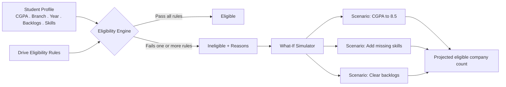
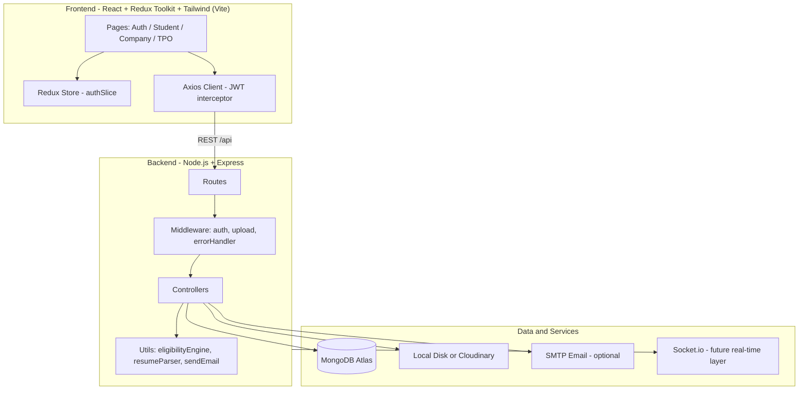
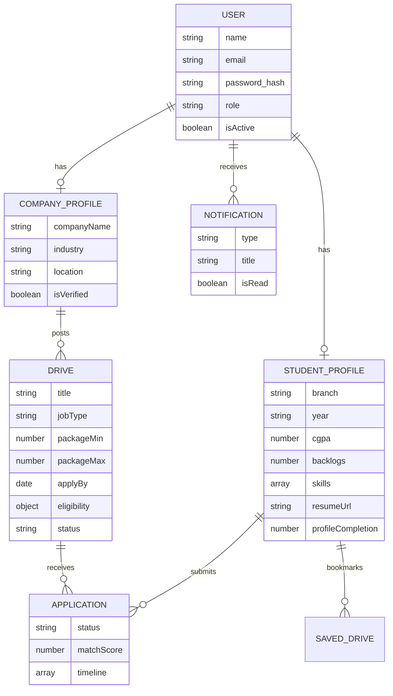
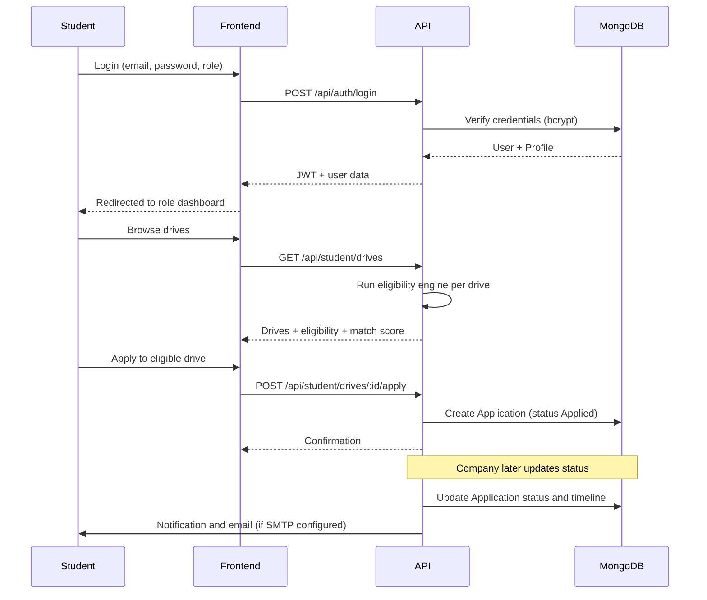

# 🎓 Campuslytics — Placement & Internship Portal

**Your Campus. Your Career.**
A full-stack MERN platform that centralizes student, company, and TPO placement workflows — automated eligibility checks, application tracking, and live placement analytics, all in one place.


---

## 📋 Table of Contents

- [Problem Statement](#-problem-statement)
- [Core Features](#-core-features)
- [Standout Feature: Eligibility Simulator](#-standout-feature-placement-eligibility-simulator)
- [Architecture](#-architecture)
- [Data Model (ER Diagram)](#-data-model-er-diagram)
- [Key Flows](#-key-flows)
- [Tech Stack](#-tech-stack)
- [Project Structure](#-project-structure)
- [Getting Started](#-getting-started)
- [Demo Accounts](#-demo-accounts)
- [Environment Variables](#-environment-variables)
- [Bulk Student Import Format](#-bulk-student-import-format)
- [Deployment](#-deployment)
- [Roadmap](#-roadmap)

---

## 📌 Problem Statement

Colleges often manage placements through spreadsheets, emails, and manual screening — making it hard to track applications, filter eligible students, and analyze placement trends. **Campuslytics** replaces that with a single platform that automates eligibility checks, application tracking, and placement analytics for students, companies, and the TPO office.

---

## ✨ Core Features

| Role | What they can do |
|---|---|
| 🎓 **Student** | Build a profile (branch, CGPA, year, skills, backlogs), upload a resume (auto-parsed for skills), browse/filter drives, see per-drive eligibility + resume match score, apply, bookmark, track application status, run the Eligibility Simulator |
| 🏢 **Company** | Manage company profile, post/edit/close drives with structured eligibility rules, view applicants ranked by match score, move applicants through the pipeline (Applied → Shortlisted → Interview → Selected/Rejected) |
| 🛠️ **TPO / Admin** | Manage students & companies, bulk-import students via CSV/Excel, view all drives & applications platform-wide, export CSV reports, view the placement analytics dashboard |

All three roles get **JWT-secured, role-gated access** and an in-app **notification center** (applications, interviews, system messages).

---

## 🧠 Standout Feature: Placement Eligibility Simulator

A fully **rule-based** engine (no ML required) that helps students understand *and improve* their eligibility:

- Shows how many companies they're currently eligible for
- Explains **exactly why** they're ineligible for a given drive (CGPA, branch, year, backlogs, or missing skills)
- Runs **what-if scenarios**: "If your CGPA becomes 8.5", "If you add these missing skills", "If you clear your backlogs" — and shows the eligibility gain for each
- Aggregates missing skills across all near-miss drives into one actionable list



---

## 🏗️ Architecture



---

## 🗂️ Data Model (ER Diagram)



---

## 🔄 Key Flows

**Authentication & Application Lifecycle**



---

## 🛠️ Tech Stack

**Frontend:** React 18 · Redux Toolkit · React Router DOM · Tailwind CSS · Axios · Recharts · Vite
**Backend:** Node.js · Express.js · Mongoose · JWT · bcrypt.js · Multer
**Database:** MongoDB (Atlas or local)
**Resume Processing:** `pdf-parse` + custom keyword-extraction skill dictionary (rule-based, no ML)
**File Storage:** Local disk by default, optional Cloudinary
**Notifications:** In-app + Nodemailer (optional SMTP), Socket.io wired as a future real-time layer
**Analytics:** MongoDB aggregation-style queries + Recharts (bar & pie charts)
**Reports:** CSV export via `csv-writer`
**Bulk Import:** SheetJS (`xlsx`) parses CSV/Excel client-side before posting to the API

---

## 📁 Project Structure

```
campuslytics/
├── backend/
│   └── src/
│       ├── config/         # db.js, cloudinary.js
│       ├── models/         # User, StudentProfile, CompanyProfile, Drive, Application, ...
│       ├── controllers/    # authController, studentController, companyController, tpoController
│       ├── routes/         # authRoutes, studentRoutes, companyRoutes, tpoRoutes
│       ├── middleware/     # auth (JWT + role guard), upload, errorHandler
│       └── utils/          # eligibilityEngine.js, resumeParser.js, sendEmail.js, seed.js
└── frontend/
    └── src/
        ├── api/            # axios client + endpoint functions
        ├── app/             # redux store + authSlice
        ├── components/     # layout (Sidebar/Topbar), common UI, DriveForm
        ├── pages/           # auth/, student/, company/, tpo/
        └── routes/          # ProtectedRoute
```

---

## 🚀 Getting Started

### Prerequisites
- Node.js 18+ and npm
- MongoDB Atlas cluster (or local MongoDB)

### 1. Backend
```bash
cd backend
npm install
cp .env.example .env      # then fill in MONGO_URI and JWT_SECRET
npm run seed               # creates demo accounts + sample drives
npm run dev                 # starts on http://localhost:5000
```

### 2. Frontend
```bash
cd frontend
npm install
cp .env.example .env       # defaults already point to localhost:5000/api
npm run dev                 # starts on http://localhost:5173
```

Open the frontend URL and log in with any [demo account](#-demo-accounts) below.

---

## 🔑 Demo Accounts

All passwords: **`Password@123`**

| Role | Email |
|---|---|
| TPO / Admin | `tpo@campuslytics.com` |
| Student | `student@campuslytics.com` (Rahul Sharma) |
| Student | `ananya@campuslytics.com` (Ananya Verma) |
| Company | `google@campuslytics.com` |
| Company | `microsoft@campuslytics.com` |
| Company | `amazon@campuslytics.com` |

> New student/company accounts can also be created from the Sign Up screen. TPO accounts are provisioned only via the seed script, matching how a real placement office would restrict that access.

---

## ⚙️ Environment Variables

**`backend/.env`**
```env
PORT=5000
NODE_ENV=development
CLIENT_URL=http://localhost:5173

MONGO_URI=mongodb+srv://<user>:<password>@<cluster>.mongodb.net/campuslytics
JWT_SECRET=change_this_to_a_long_random_secret
JWT_EXPIRES_IN=7d

STORAGE_DRIVER=local          # or "cloudinary"
CLOUDINARY_CLOUD_NAME=
CLOUDINARY_API_KEY=
CLOUDINARY_API_SECRET=

SMTP_HOST=                      # leave blank to skip email sending safely
SMTP_PORT=587
SMTP_USER=
SMTP_PASS=
EMAIL_FROM=Campuslytics <no-reply@campuslytics.com>
```

**`frontend/.env`**
```env
VITE_API_URL=http://localhost:5000/api
```

> ⚠️ Never commit real `.env` files. Only `.env.example` should be tracked in git — check `git status` before your first commit to confirm.

---

## 📊 Bulk Student Import Format

TPO → Students → **Bulk Import** accepts `.csv` or `.xlsx` with these columns:

```
name, email, password, branch, year, cgpa, backlogs, skills, rollNumber
```
`skills` accepts a comma/semicolon-separated string, e.g. `"Python, DSA, SQL"`.

---

## ☁️ Deployment

| Layer | Suggested host | Notes |
|---|---|---|
| Frontend | Vercel / Netlify | `npm run build` then deploy `frontend/dist`; set `VITE_API_URL` to your live backend |
| Backend | Render | Set all `backend/.env` variables in host settings; set `CLIENT_URL` to your deployed frontend origin for CORS |
| Database | MongoDB Atlas | Whitelist your backend host's IP (or `0.0.0.0/0` for quick testing) under Network Access |

---

## 🗺️ Roadmap

- [ ] Live push notifications over the existing Socket.io layer
- [ ] Resume-to-JD semantic matching (beyond keyword overlap)
- [ ] Interview scheduling calendar sync
- [ ] Company-side analytics (funnel conversion per drive)

---

<p align="center">Built for campuses that want placements to run on data, not spreadsheets.</p>
